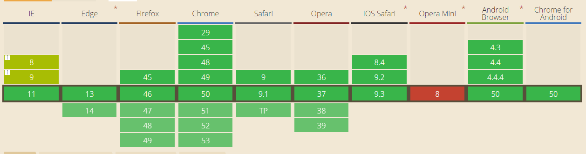
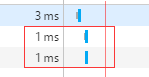

## non-blocking scripts 非阻塞脚本

>尽管下载一个大 JavaScript 文件只产生一次 HTTP 请求，却会锁定浏览器一大段时间。为避开这种情况，你
需要向页面中逐步添加 JavaScript，某种程度上说不会阻塞浏览器。

+ Deferred Scripts 延期脚本

在脚本script标签上加上"defer"字段，即表明此脚本为一个延期加载的脚本，该脚本触发时间为：在DOM加载之后，在页面Load之前

技巧：因此，在加上了defer字段的脚本之中，不能有任何进行提前DOM的操作，否则将会报错

问题：在书中说明了只要在script中加上了"defer"字段，都会被认为是延期脚本，但在实际测试中，发现只有在外部引入的脚本上加入"defer"字段才会有延期脚本的效果，只有在这种情况下，才能出现脚本的并行加载情况

**defer支持情况**


**测试环境**
Chrome 49/ FireFox 45/ IE exploer 10

**结果**
```javascript
	<script src="js/defer.js" defer></script>
	<script src="js/normal.js"></script>
	<script>
		window.onload = function() {
			console.log("load");
		}
	</script>
```

控制台依次打印：normal -> defer -> load，浏览器并行加载js


如果去掉 defer 字样， 控制台打印结果为： defer -> normal -> load

另外如果代码为直接内嵌
```javascript
	<script defer>
		console.log("defer");
	</script>
	<script>
		console.log("normal");
	</script>
	<script>
		window.onload = function() {
			console.log("load");
		}
	</script>
```

控制台打印结果为： defer -> normal -> load， 发现并未出现书中的defer情况


